# Выполнение домашнего задания №3

## 1. Создаем кастомный образ PostgreSQL 16.11 с именем "pg-shop" и тегом "latest" и с локалью RU

```bash
docker build -f Dockerfile -t pg-shop .
```

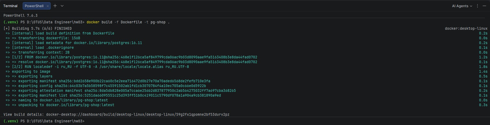

Проверка 
```bash
docker images
```

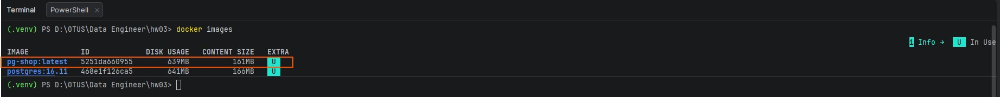

---

## 2. Запускаем контейнер с именем "pg-shop" через Docker Compose.

```bash
docker-compose up -d
```

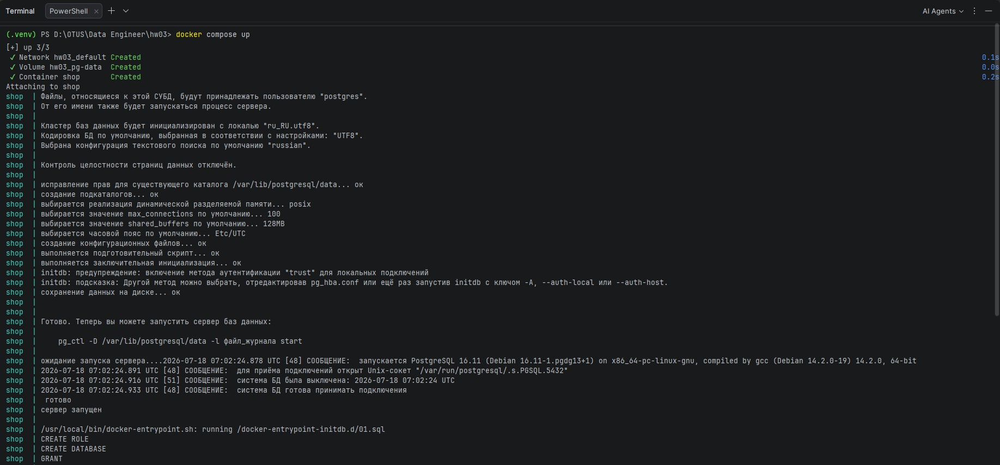

Проверка
```bash
docker ps
```

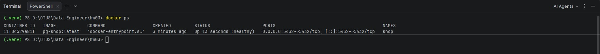

Запуск сервиса и контейнера с именем 'pg-shop' обусловлен необходимостью запуска инициализирующего скрипта init.sql, 
который выполняется при запуске контейнера и создает базу данных 'shop' и пользователя 'shop-admin'.

---

## 3. Подключение источника (базе данных 'shop') в PyCharm 'Database Tools and SQL'

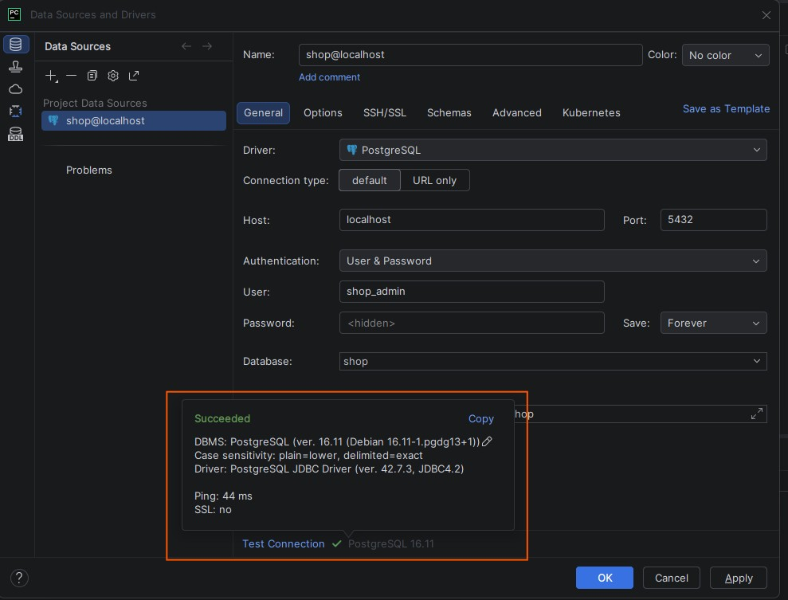

---

## 4. Создание таблиц 'customers', 'products' и 'orders'

Запуск производится внутри PyCharm, используя встроенный инструмент 'Database Tools and SQL'.

```sql
CREATE TABLE customers (
    customer_id SERIAL PRIMARY KEY,
    name        TEXT NOT NULL,
    email       TEXT UNIQUE NOT NULL
);

CREATE TABLE products (
    product_id SERIAL PRIMARY KEY,
    title      TEXT NOT NULL,
    price      NUMERIC(10,2) NOT NULL CHECK (price >= 0)
);

CREATE TABLE orders (
    order_id    SERIAL PRIMARY KEY,
    customer_id INT NOT NULL REFERENCES customers(customer_id),
    created_at  TIMESTAMP NOT NULL DEFAULT now()
);
```

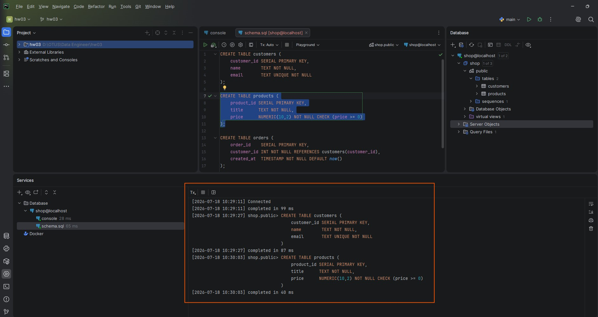

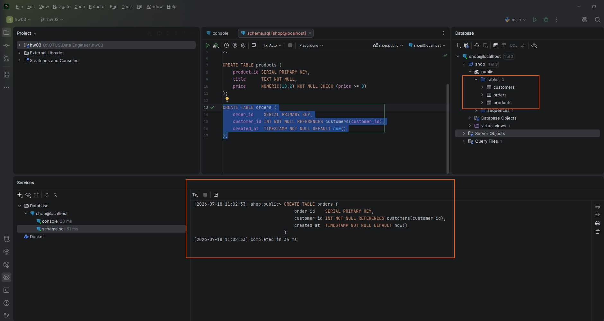

---

## 5. Заполнение таблиц 'customers', 'products' и 'orders' первичными данными

```sql
INSERT INTO customers (name, email) VALUES
    ('Иван Петров', 'ivan@example.com'),
    ('Мария Сидорова', 'maria@example.com'),
    ('Пётр Кузнецов', 'petr@example.com');

INSERT INTO products (title, price) VALUES
    ('Ноутбук', 89999.00),
    ('Мышь', 1499.00),
    ('Монитор', 24999.00);

INSERT INTO orders (customer_id) VALUES (1), (1), (2), (3);
```

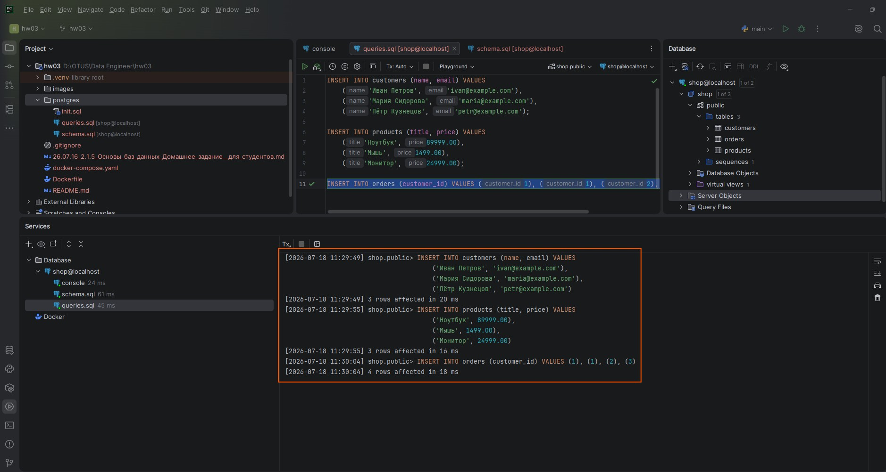

---

## 6. Выполнение различных запросов

```sql
SELECT p.title, p.price
FROM products p
WHERE p.price > 2000 ORDER BY p.price DESC;

SELECT *
FROM orders
WHERE customer_id = 1 ORDER BY created_at;

SELECT c.name, c.email, o.order_id, o.created_at
FROM customers c
JOIN orders o ON o.customer_id = c.customer_id
ORDER BY c.name;
```

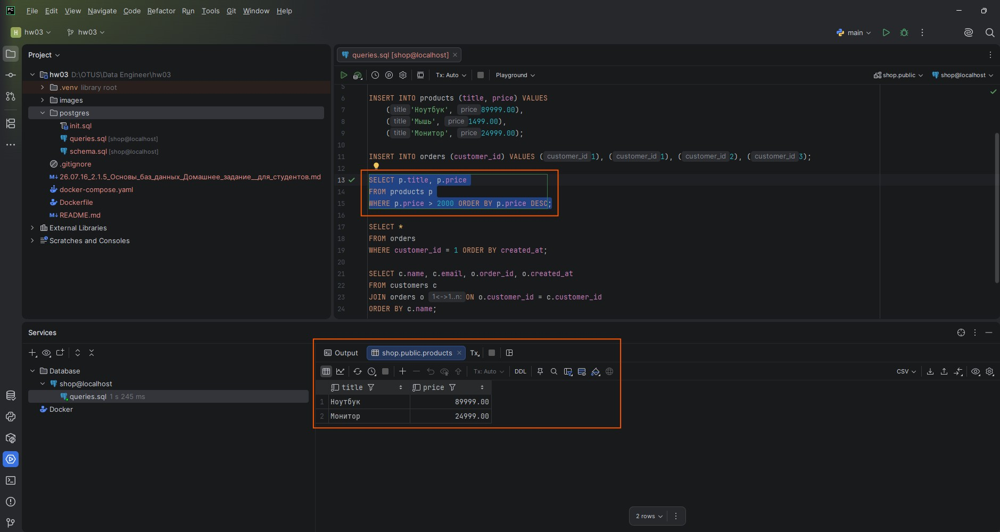

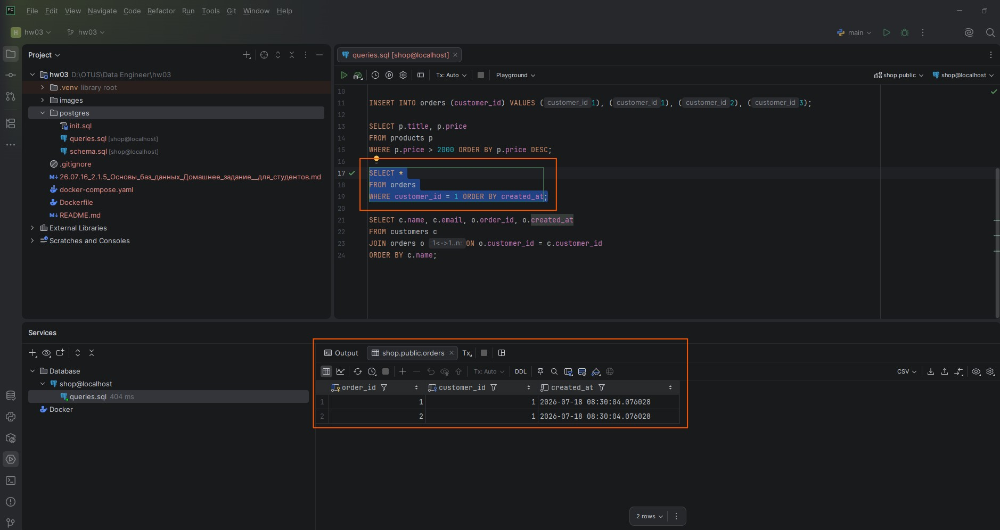

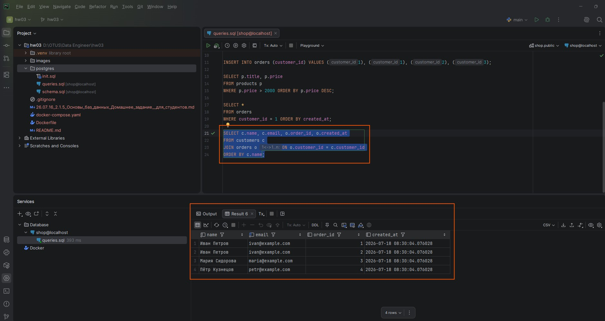

---

## 7. Бонусное задание "Вариант A" - таблица `order_items` (M:N):

### Создание таблицы 'order_items'

```sql
CREATE TABLE order_items (
    order_id   INT NOT NULL REFERENCES orders(order_id),
    product_id INT NOT NULL REFERENCES products(product_id),
    qty        INT NOT NULL CHECK (qty > 0),
    PRIMARY KEY (order_id, product_id)
);
```

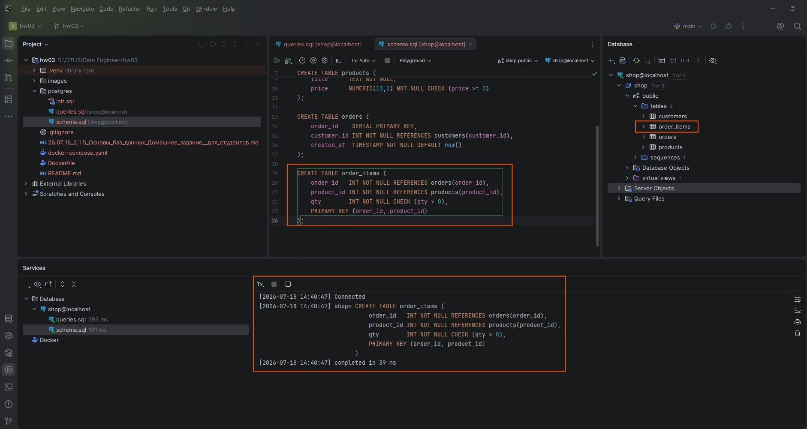

### Заполнение таблицы 'order_items' первичными данными

```sql
INSERT INTO order_items (order_id, product_id, qty) VALUES
    (1, 1, 2), (1, 2, 1), (2, 3, 1);
```

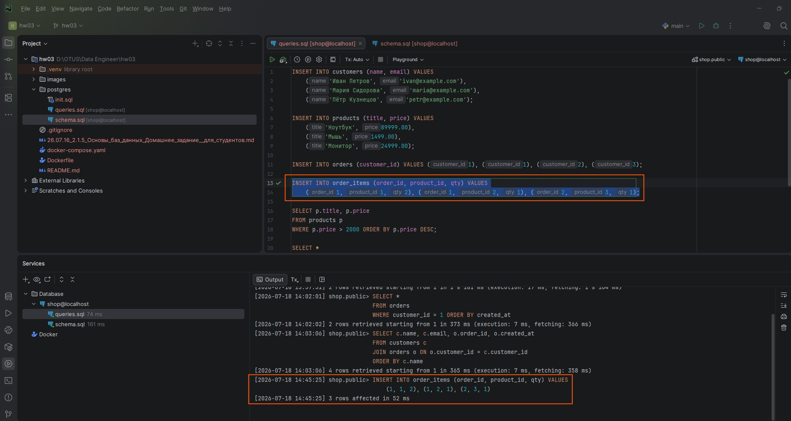

### Выполнение SELECT запроса с использованием `JOIN` через `order_items` и агрегат — сумму заказа

```sql
SELECT o.order_id, c.name, SUM(p.price * oi.qty) AS total
FROM orders o
JOIN customers c ON c.customer_id = o.customer_id
JOIN order_items oi ON oi.order_id = o.order_id
JOIN products p ON p.product_id = oi.product_id
GROUP BY o.order_id, c.name
ORDER BY o.order_id;
```

.jpg)

---

## 8. Бонусное задание "Вариант С" - индекс и EXPLAIN:

### Создание таблицы 'big_orders'

```sql
CREATE TABLE big_orders (
    order_id    SERIAL PRIMARY KEY,
    customer_id INT NOT NULL,
    created_at  TIMESTAMP NOT NULL DEFAULT now()
);
```

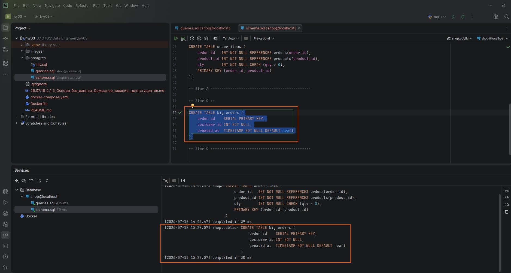

### Заполнение таблицы 'big_orders' первичными данными

```sql
INSERT INTO big_orders (customer_id)
SELECT (random() * 10000)::int
FROM generate_series(1, 100000);
```

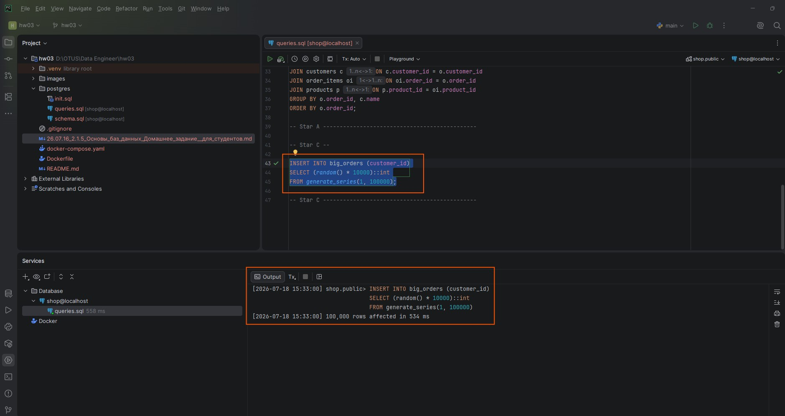

### Выполнение плана запроса EXPLAIN без создания индекса в таблице 'big_orders'

```sql
EXPLAIN SELECT * FROM big_orders WHERE customer_id = 42;
```

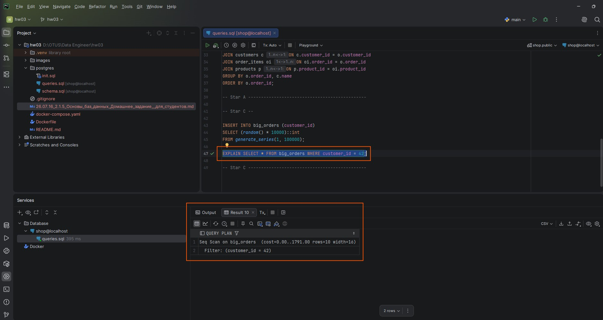

### Объяснение плана запроса (без использования индекса)
1. Seq Scan (Sequential Scan) - PostgreSQL читает таблицу big_orders последовательно, блок за блоком, от начала до конца.
2. Cost=0.00..1791.00 - планировщик оценивает "стоимость" операции. 0.00 - это стоимость запуска, 
1791.00 - оценочная стоимость полного сканирования всей таблицы. 
Это относительные единицы, по которым PostgreSQL сравнивает разные планы. Чем выше число, тем "дороже" операция.
3. Rows=10 - планировщик ожидает, что условие customer_id = 42 найдёт примерно 10 строк. 
Это значение берётся из статистики таблицы (которую PostgreSQL собирает при ANALYZE).
4. Width=16 - оценочный размер одной строки результата в байтах.
5. Filter: (customer_id = 42) - движок базы данных не может сразу перейти к нужным строкам, 
поэтому он читает каждую строку подряд и применяет фильтр: "Если customer_id равен 42 - оставить, иначе - отбросить".

### Создание индекса

```sql
CREATE INDEX idx_big_orders_customer_id ON big_orders (customer_id);
```

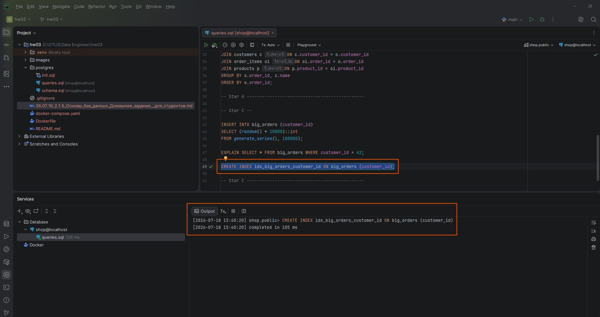

### Выполнение плана запроса EXPLAIN с использованием индекса

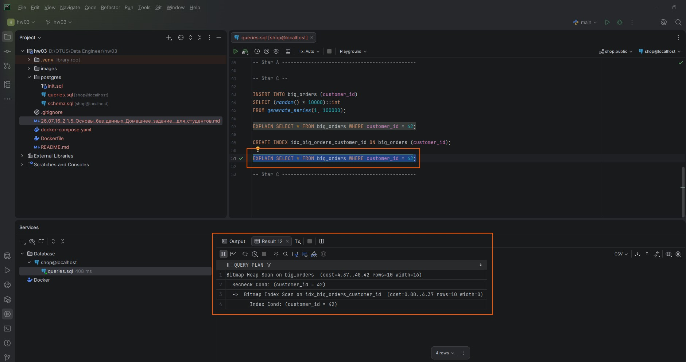

### Объяснение плана запроса (с использованием индекса)
1. Bitmap Index Scan (нижняя строка) - первый этап. 
PostgreSQL обращается к индексу idx_big_orders_customer_id и быстро находит все идентификаторы строк (TID), где customer_id = 42.
Результат не возвращается сразу, а записывается во временную структуру - "битовую карту" (bitmap). Это просто список "где лежат нужные данные".

2. Bitmap Heap Scan (верхняя строка) - второй этап. Движок базы данных читает страницы таблицы big_orders, но только те, 
что указаны в битовой карте. То есть он не сканирует всю таблицу подряд, а целенаправленно подтягивает нужные страницы.

3. Recheck Cond - из‑за особенностей работы Bitmap‑сканов в PostgreSQL иногда требуется перепроверить условие прямо по данным таблицы. 
Это штатный механизм для гарантии точности (особенно при параллельных изменениях данных).

### Сравнение планов:

| <b>Параметр</b>  |   <b>Без индекса (Seq Scan)</b> |     <b>С индексом (Bitmap Heap Scan)</b> | <b>Разница</b>                         |
|------------------|--------------------------------:|-----------------------------------------:|----------------------------------------|
| Cost (стоимость) |                        ~1791.00 |                              ~4.37–40.42 | В ~40–50 раз дешевле                   |
| Стратегия        |      Чтение всей таблицы подряд |               Целевой поиск через индекс | Полное сканирование vs точечный доступ |
| Нагрузка на I/O  | Высокая (читаются все страницы) | Низкая (читаются только нужные страницы) | Существенное снижение нагрузки         |