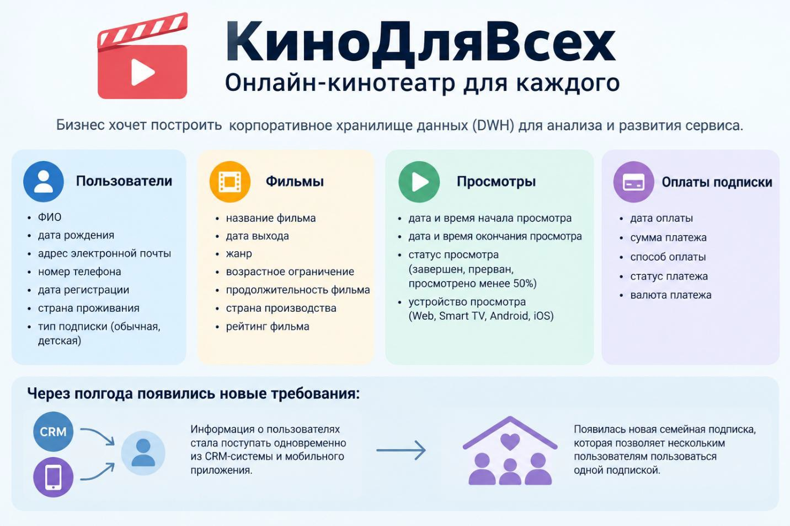

# Домашнее задание №4 по уроку №9 "Модели данных в DWH"

## Проектирование DWH по модели Data Vault

### Вы работаете Data Engineer в компании "КиноДляВсех". Бизнес хочет построить корпоративное хранилище данных для онлайн-кинотеатра.

### В хранилище необходимо загружать следующую информацию:

### **О пользователях:**
  - ФИО;
  - дата рождения;
  - адрес электронной почты;
  - номер телефона;
  - дата регистрации;
  - страна проживания;
  - тип подписки (обычная, детская).

### **О фильмах:**
  - название фильма;
  - дата выхода;
  - жанр;
  - возрастное ограничение;
  - продолжительность фильма;
  - страна производства;
  - рейтинг фильма.

### **О просмотрах:**
  - дата и время начала просмотра;
  - дата и время окончания просмотра;
  - статус просмотра (завершен, прерван, просмотрено менее 50%);
  - устройство просмотра (Web, Smart TV, Android, iOS).

### **Об оплатах подписки:**
  - дата оплаты;
  - сумма платежа;
  - способ оплаты;
  - статус платежа;
  - валюта платежа.

### Необходимо:

1. Спроектировать модель Data Vault для данной предметной области;
2. Определить:
   - Hub-таблицы;
   - Link-таблицы; 
   - Satellite-таблицы.
3. Для каждой таблицы определить:
   - Бизнес и суррогатный ключи (при наличии);
   - Описательные атрибуты (при наличии);
   - Связи с другими таблицами.
   По необходимости разрешено самостоятельно вводить ID. Например, ID пользователя.
4. Изобразить итоговую схему Data Vault с указанием связей между таблицами.

### Задание со звездочкой (*)
Через полгода появились новые требования:
- информация о пользователях стала поступать одновременно из CRM-системы и мобильного приложения;
- появилась новая семейная подписка, которая позволяет нескольким пользователям пользоваться одной подпиской.

### **Ответьте на вопросы:**
- потребуется ли создавать новые Hub, Link или Satellite;
- какие таблицы останутся без изменений.
