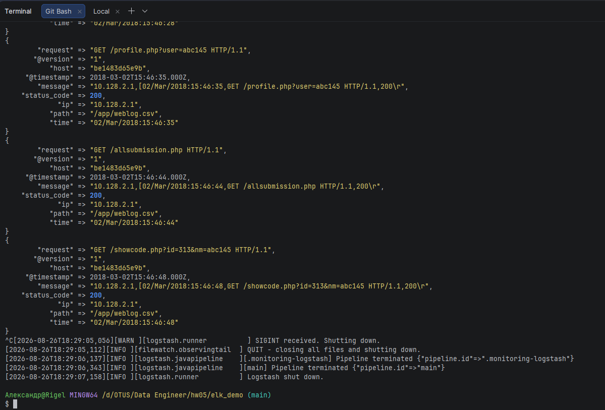
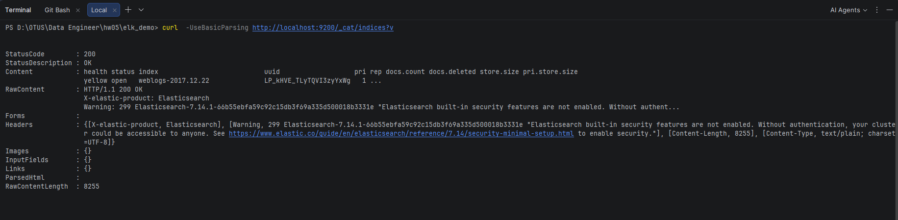
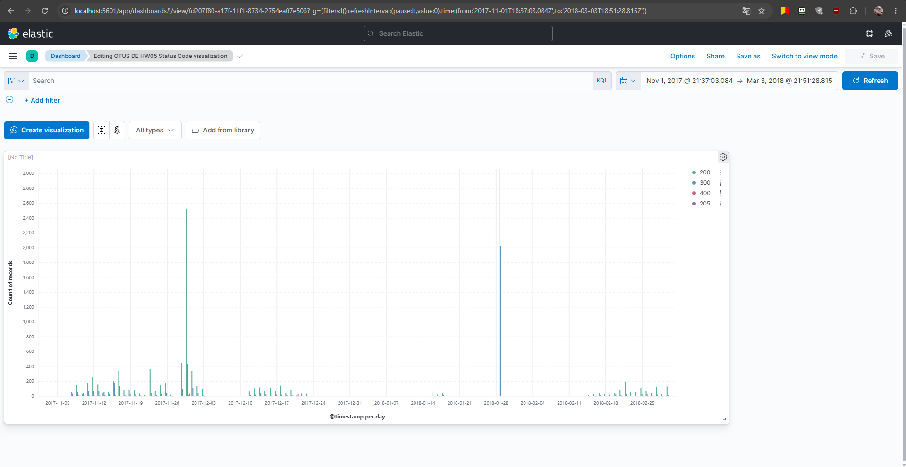

# HW05 - Анализ веб-логов с помощью ELK

### Домашнее задание №5 по курсу "Инженер данных" OTUS.

## Цель

### В рамках ДЗ нужно будет загрузить данные в ElasticSearch и построить дашборд в Kibana.

## Выполнение задания
### <u>1. Запуск pipeline скрипта load_data.sh</u>

### <u>2. Проверка, что индекс создан и заполнен данными</u>

### <u>3. Дашборд в Kibana</u>
